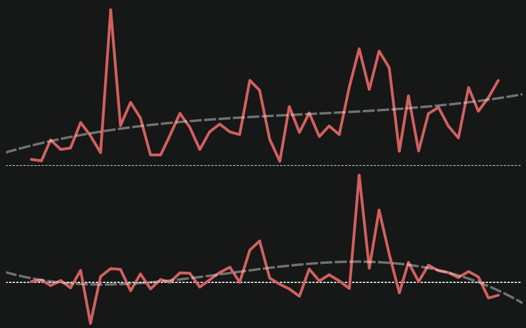
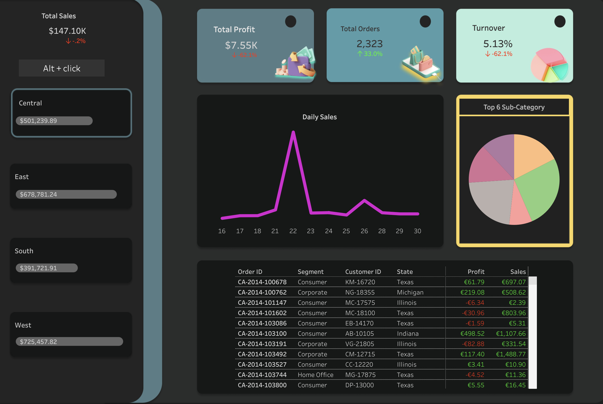
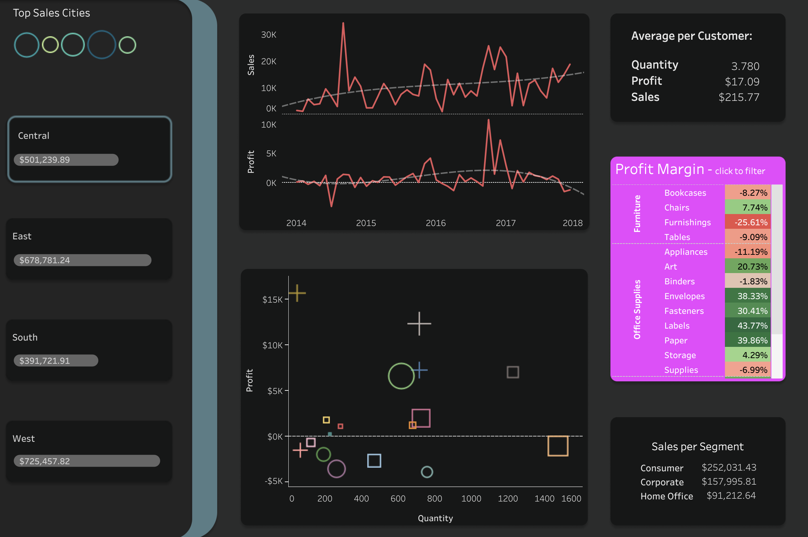

# Sales insights analysis - not tl;dr 

This repository contains a sales insight dashboard for a retail store. The dashboard provides visualizations to gain insights into sales performance, customer behavior, and product trends from the last 4 years, collectively. The dashboard is built using Tableau. 

  

## Data Source

The [dataset](https://community.tableau.com/s/question/0D54T00000CWeX8SAL/sample-superstore-sales-excelxls) used is of a sample retail superstore fetched from Tableau's community section.

Data aquired from the source includes 4 year information on orders, products, customers, revenue, profit, location etc. The spreadsheet has 9995 order entries of 5004 distinct customers. 

## Data Manipulation

The purpose of this project was to create and analyse compelling dashboards with advanced calculations, filters and design features. Data cleaning and manipulation process found no null, redundant or improper formatting. [This jupyter](Untitled.ipynb) file contains the brief statistical description and manipulation process.

## Analysis and Designing

These high-level tableau [dashboards](https://public.tableau.com/app/profile/suryansh.jamwal/viz/SalesinsightsDashboard/Dashboard1) were inspired by [lovelytics](https://www.youtube.com/watch?v=nkIy3ruOmZw) design features on a similar dataset. 

### Design tools used - 

* figma
* Canva
* sketch

### Tableau features used - 

* Calculated fields
* Segmentation
* Actions and filters
* Grouping
* Time-series Analysis

### Navigating the dashboards - 

* Summary - 

Summarises the daily sales, current year metrics and most recent orders list. Arrowed indicators display percent change from prior year.

This dashboard changes values and can be filtered on regions - Central, East, South and West by selecting from the left pane. Using Alt + right mouse click on the button maximises the orders list. Hovering on the trends and pie chart provides more information.

  

* Details - 

Shows Self-explanatory and interactive high-level details of sales, profit and customer averages. Profit and sales interpretation is adjustable on a daily, monthly, quaterly and yearly basis.

This dashboard can be filtered on region and category/sub-category of products. The pink box reflects profit margin on each type of sub-category. By clicking on the category/sub-category name, the dashboard can be adjusted.

  

## Key findings and recommendations

* Market in the regions East and West are better performing than their counterparts in terms of overall total profit, revenue, orders and turnover.

* Monthly sales over the 4 years have seen an upward trend in all regions however, the same cannot be said for overall profit in the Central and the South. Cause of which is due to high volume sales of low/negative profit margin products and high costs.

* Top High profit products - Category 'Technology' including Phones, copiers and accessories.

* Top Selling products - Chairs, storage, binders and phones.

* Top High profit margin products - Category 'Office Supplies' including Envelopes, Fasteners, Labels and Paper. Category 'Technology' including Copiers and Accessories.

* More sales doesn't necessarily mean more profit which is true conversely as well. Trends of which can be seen on the interpretation of profit on quantity. This obscure disparity is a substantial effect of cumulative deductions from expenses, costs, and taxes.

* To improve performance of the store, invest on marketing high profit margin products as more sales is not the always the way to go. 

* Better turnover can be achieved by emphasis on High ticket (low deductions and high profit margin) products. For low ticket products, selling products inducing lower costs and taxes.

