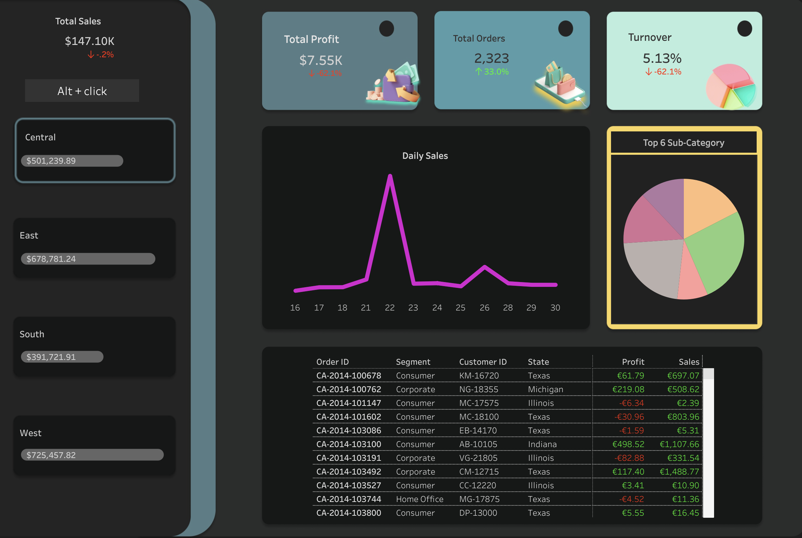

# Sales insights analysis - not tl;dr 

This repository contains a sales insight dashboard for a retail store. The dashboard provides visualizations and to gain insights into sales performance, customer behavior, and product trends. The dashboard is built using Tableau. 

## Data Source

The dataset used is of a sample retail superstore from Tableau's community section. Link - [salesDataset](https://community.tableau.com/s/question/0D54T00000CWeX8SAL/sample-superstore-sales-excelxls)

Data aquired from the source includes 4 year information on orders, products, customers, revenue, profit, location etc. The spreadsheet has 9995 order entries of 5004 distinct customers. 

## Data Manipulation

The purpose of this project was to create and analyse compelling dashboards with advanced calculations, filters and design features. Data cleaning and manipulation process found no null, redundant or improper formatting. [This jupyter] file contains the brief statistical description and manipulation process.

## Analysis and Designing

These high-level tableau [dashboards](https://public.tableau.com/app/profile/suryansh.jamwal/viz/SalesinsightsDashboard/Dashboard1) were inspired by [lovelytics](https://www.youtube.com/watch?v=nkIy3ruOmZw) design features on a similar dataset. 

### Design tools used - 

* figma
* Canva
* sketch

### Tableau features used - 

* Calculated fields
* Segmentation
* Actions and filters
* Grouping
* Time-series Analysis

### Navigating the dashboards - 

  

  

